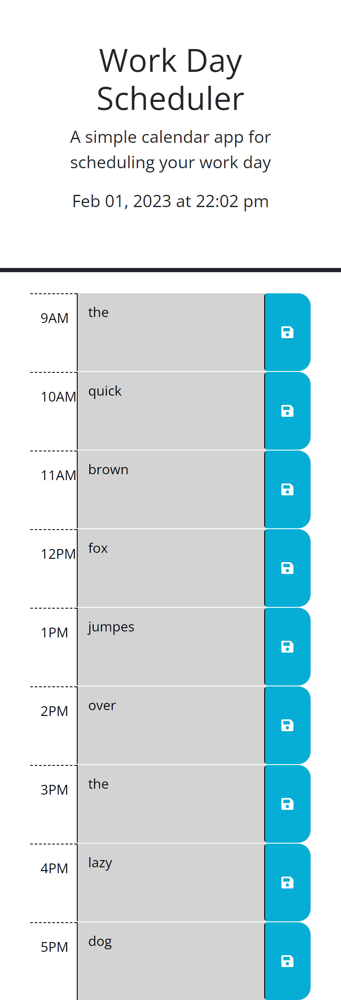

# 05 Third-Party APIs: Work Day Scheduler

## Task

Create a simple calendar application that allows a user to save events for each hour of the day by modifying starter code. This app will run in the browser and feature dynamically updated HTML and CSS powered by jQuery.

You'll need to use the [Day.js](https://day.js.org/en/) library to work with date and time. Be sure to read the documentation carefully and concentrate on using Day.js in the browser.


## Acceptance Criteria

```md
GIVEN I am using a daily planner to create a schedule
WHEN I open the planner
THEN the current day is displayed at the top of the calendar
WHEN I scroll down
THEN I am presented with timeblocks for standard business hours
WHEN I view the timeblocks for that day
THEN each timeblock is color coded to indicate whether it is in the past, present, or future
WHEN I click into a timeblock
THEN I can enter an event
WHEN I click the save button for that timeblock
THEN the text for that event is saved in local storage
WHEN I refresh the page
THEN the saved events persist
```


https://davercodes.github.io/color-reactive-schedule/




## Credits
- - -
the answers given on this stack overflow heavily inspired the way I pulled and pushed local storage information
 https://stackoverflow.com/questions/42963091/how-to-save-the-value-of-textarea-to-localstorage-then-display-it-in-the-same-te 

A special thanks to Kyle Shakely for assistance regardint updating tasks and proper use of the localStorage.getItem function

A special thanks to Jen Roberson for assistance with properly accessing the .css and .html information to make the time-color changing features work


## Review

You are required to submit the following for review:

* The URL of the deployed application

* The URL of the GitHub repository, with a unique name and a README describing the project

- - -
© 2022 edX Boot Camps LLC. Confidential and Proprietary. All Rights Reserved.
