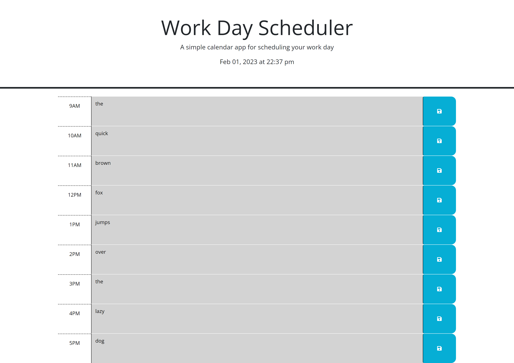

# color-reactive-schedule

- - -
## User Experience Expectation

when the user is operating this deployment, they will be met with a simple top-down site that has the date and time visible on load followed by an array of text blocks with their hours indicated on the left along with their save buttons on the right.

this sight allows the user to see the time as it is indicated at the top of the page along with a visual representation, as each hourly text block reacts to the time, being grey if the hour indicated is the past, orangew if the hour indicated is the present, and green if the hour indicated is the future. This color coding is designed to assist the user as they plan out their day, and when they save their text, they can easily close and reopen the schedule at any given time without losing important information.

## Check out my Deployment here! 
https://davercodes.github.io/color-reactive-schedule/

## Credits
- - -
the answers given on this stack overflow heavily inspired the way I pulled and pushed local storage information
 https://stackoverflow.com/questions/42963091/how-to-save-the-value-of-textarea-to-localstorage-then-display-it-in-the-same-te 

A special thanks to Kyle Shakely for assistance regardint updating tasks and proper use of the localStorage.getItem function

A special thanks to Jen Roberson for assistance with properly accessing the .css and .html information to make the time-color changing features work

## Review

You are required to submit the following for review:

* The URL of the deployed application

* The URL of the GitHub repository, with a unique name and a README describing the project

- - -
© 2022 edX Boot Camps LLC. Confidential and Proprietary. All Rights Reserved.
